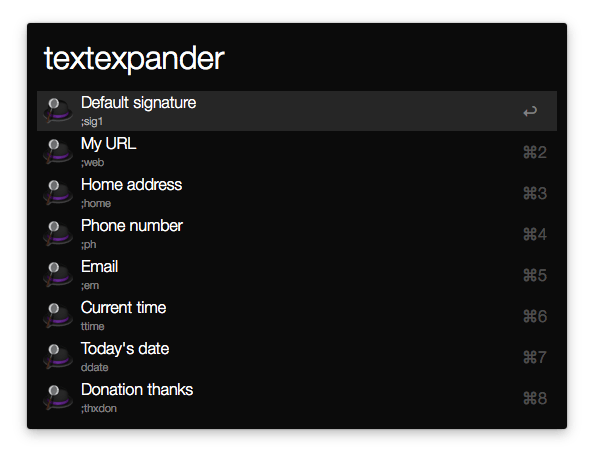

# Alfred TextExpander Workflow

Alfred workflow to query and execute TextExpander snippets.

## Usage

Activate the keyword ```expand``` to see the list of snippets, and continue typing to filter among the list. Activating ```Enter``` on any result will _type_ (vía AppleScript, not paste) the abbreviation. This is due to a simple paste not triggering the expansion, possibly because TextExpander is listening for keystrokes and only expands when the proper keys were pressed in order. I assumed that the workflow would require accesibility permissions for Alfred to perform the keystrokes, but even after disabling every plausible permission, the workflow was still working fine. Please file a ticket if you can confirm this.



## Installation
Download the [alfred-textexpander-workflow.alfredworkflow](alfred-textexpander-workflow.alfredworkflow?raw=true) and import to Alfred 2.


## Changelog
* _2015-09-21_ Released
